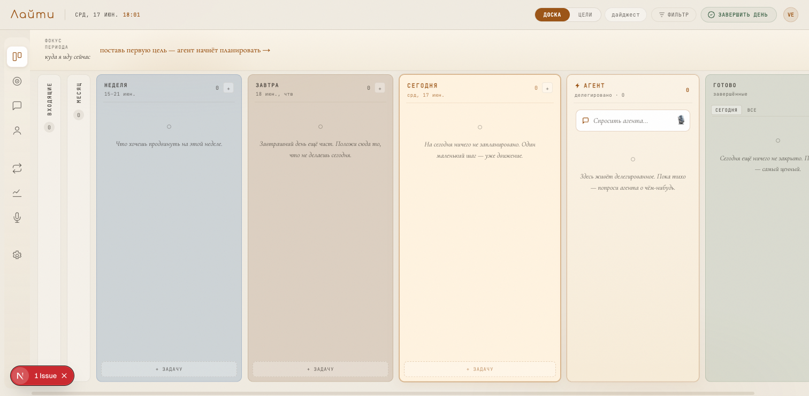

# grace-board

A local kanban **dispatch board** for the [`grace-feature-dev`](.claude/skills/grace-feature-dev)
pipeline. Accumulate tasks in **Backlog**; drag a card across the **launch lever** and
the team of agents picks it up — the card then rides the stations on its own, from
questions through implementation, verification and review, to *Ready for deploy*.

Zero dependencies, no build step — plain Node ≥ 18, bound to `127.0.0.1` (local only).



## What's in this repo

| Path | What it is |
|---|---|
| `server.js`, `public/` | the board — a zero-dependency Node HTTP server + static UI |
| `.claude/commands/grace-feature-dev.md` | the `/grace-feature-dev` slash command |
| `.claude/agents/gfd-*.md` | the pipeline's sub-agents (architect, coder, explorer, reviewer, verifier) |
| `.claude/skills/grace-feature-dev` | the pipeline skill — board lifecycle, build phases, GRACE markup, anti-loop |
| `install.sh` | links the command/agents/skill into your `~/.claude` |

> The board is a **dispatcher**: it spawns `claude -p "/grace-feature-dev …"` runs
> inside your *target* project. Those runs resolve the command, agents and skills from
> your **user-level** Claude config (`~/.claude`) — not from this repo. That's why the
> extensions are bundled here **and** installed into `~/.claude` by `install.sh`.

## Why GRACE — the method behind the board

GRACE is a methodology by Vladimir Ivanov, and its idea is simple: don't project human
traits onto a language model, work with how it's actually built. And it's built in an
unfamiliar way. It reads text only left to right and can't look back; on a long context
its attention quietly drifts. Almost every mistake people make with AI comes from talking
to it like a person. The board and the `grace-feature-dev` pipeline are built precisely to
avoid those mistakes. Here's what that buys you in practice:

- **Documentation lives inside the code, not in separate files.** A standalone doc gets
  ignored by the agent almost half the time. And if it has drifted from the code, it only
  makes things worse: the model trusts the doc over the code and forms the wrong picture.
  When the description is written straight into the code, it can't be skipped. It's about
  three times smaller than separate docs (roughly 20–30% of the code's size), and it saves
  tokens on top — because what's expensive is generation, not reading. That's what the
  **GRACE markup** toggle is for. And the point is to describe not the algorithm itself
  (the model reads that fine on its own) but what you *can't* see from the code: why it was
  written, why this design and not another, the module map, the use cases.

- **The goal comes first, the breakdown into steps comes after.** For the model the goal
  outweighs any of your instructions, so a run first spells out what it's after, and only
  then splits that big goal into subgoals — the cards on the board. But the top goal itself
  the model can't set: leave it alone and it drifts toward doing nothing. Only you can set
  that goal, and that's what **Backlog** is for.

- **Don't redo — hold several options at once.** A model has nothing to really "change its
  mind" with: a reversed decision easily pulls it into hallucinations and a jump backwards.
  So instead of rewriting, at each fork (the **Asking · architecture** gate) it lays out
  2–4 options with their pros and cons and suggests which to take. Picking one is cheap for
  it — just tipping the balance toward a branch. For code, 3–5 such options is about right.

- **Every decision is made before the first line of code is written.** Rolling something
  back is expensive for the model: a cancelled decision doesn't disappear, it stays in the
  context as a contradiction and drags quality down — the same effect as a drifted doc. So
  every choice is made up front, while the context is still clean: first discovery, then
  clarify, then architecture. Only then comes the code — straight through, no U-turns:
  implement, verify, review. The result: no rewriting code that's already been generated,
  no context clogged with a mix of the old and new plan, and runs that come out cheaper and
  more predictable. The flexibility you'd normally get from "build it, then rebuild it"
  shows up earlier here — in those architecture options, which cost the model almost nothing
  to switch between.

- **The context is marked up so attention can hold onto it.** After the first 10–20k
  tokens, gaps open up in attention (up to 96% of it), and the model gets dumber without
  noticing — while cheerfully reporting that all is well. Paired anchor tags and a generous
  scatter of keywords (in the code *and* the logs) keep a session coherent across 200–300k
  tokens, and give agents something to grab onto when searching with grep. All of this is
  carried by the GRACE markup.

- **A separate agent does the checking, because the model can't be taken at its word.** It
  says "all good" even when things are bad, so there's little to trust here. In the
  **Verify** phase an independent agent goes to work: it takes the logs from a real run and
  checks whether the execution path matched what was planned. Its backstop is the green
  checkpoints — each card becomes a point you can always roll back to.

> From the notes on the GRACE methodology (V. Ivanov). The short version: the model reads
> only backwards; the goal matters more to it than your instructions, so anything it deems
> weak it will quietly ignore; on a long context it gets dumber and hides it; it needs room
> to "think"; and the choice of tech stack matters more than the requirements themselves.

## Quick start

Requires [Claude Code](https://claude.com/claude-code) (the `claude` CLI) and Node ≥ 18.

```bash
git clone https://github.com/maksimovyar/grace-board.git
cd grace-board

# 1) install the /grace-feature-dev command, gfd-* agents and the skill into ~/.claude
./install.sh

# 2) configure (optional — sane defaults otherwise)
cp .env.example .env        # then edit GRACE_PROJECTS_ROOT / GRACE_CLAUDE_BIN

# 3) run the board
npm start                   # or: node server.js
# → http://127.0.0.1:4317
```

`install.sh` **symlinks** each extension into `~/.claude/{commands,agents,skills}`, so a
later `git pull` keeps them current. Pre-existing, non-symlink files are never
overwritten. Start a fresh Claude Code session afterwards so it picks up the command.

### Configuration (env vars / `.env`)

`.env` in the repo root is auto-loaded on start; exported environment variables win
over it. See [`.env.example`](.env.example).

| var | default | meaning |
|---|---|---|
| `GRACE_BOARD_PORT` | `4317` | port the board listens on (loopback only) |
| `GRACE_PROJECTS_ROOT` | `~/Projects` | root your projects live under; a task's project must resolve inside it |
| `GRACE_CLAUDE_BIN` | `~/.local/bin/claude` | path to the Claude CLI the server spawns |
| `GRACE_BIN_PATH` | derived | extra `PATH` for spawned runs, if `claude`/`node` aren't on it |
| `GRACE_AUTORUN` | on | set `0` to disable auto-launch (dispatch then only seeds) |
| `GRACE_STALL_MIN` | `120` | minutes a phase may stall before the watchdog steps in |

## Stations (= the grace-feature-dev build phases)

```
01 Backlog ─┤launch lever├─ 02 To do → 03 Asking → 04 Implementing → 05 Verifying → 06 Reviewing → 07 Ready for deploy     · Blocked
```

- **Backlog** — the only station you add to. Tasks wait here until you're ready.
- **Launch lever** — dragging a card OUT of Backlog **dispatches** it: the card is
  stamped, a `dispatch` event is logged, a `board.json` seed is written into the
  project, and the run starts.
- **Asking** — the two-block HITL gate (see below). The card waits on you here.
- **Implementing → Verifying → Reviewing** — the agent-held build phases; the card's
  lamp pulses while a `gfd-*` agent works it.
- **Ready for deploy** — terminal: all gates green.
- **Blocked** — a side state for cards that need you (run died/stalled twice, anti-loop tripped).

## Creating tasks

**+ New task** opens a composer with: **Project** (folder under your projects root,
required), **Theme** (the headline the team builds against, required), **Description**
(detail, up to 2000 chars), **Design link** & **Requirements link** (optional),
**Attachments** (screenshots / requirements files, ≤ 8 MB each), and the **GRACE
markup** toggle. A Backlog task can be re-opened and **edited** until you dispatch it.

## Asking — the two-block gate

The process always asks before it builds. After dispatch the run does discovery and
stops at **Asking**, which has two blocks:

1. **Functional** — the agent posts questions about *what* to build; you answer them
   on the card.
2. **Architecture** — the agent then proposes, for each fork (storage, stack,
   integrations, …), **2–4 variant options with pros/cons** and a recommended pick.
   You choose one per decision (or write your own), then **launch the build**.

Only after both blocks does the build run to **Ready for deploy**. (If the agent
decides no architecture forks are needed, it proceeds straight to the build.)

## How dispatch connects to the pipeline (auto-launch)

On dispatch the server:

1. writes a pipeline seed `<project>/.grace-feature-dev/<slug>/board.json`
   (creating the project dir for a greenfield task) + an audit line in
   `data/dispatch-log.ndjson`, and
2. **spawns a headless, autonomous `claude -p "/grace-feature-dev …"` run** in the
   project. Dispatch runs the **Asking · functional** step (posts questions, stops);
   answering launches **Asking · architecture** (posts decisions, stops); choosing
   launches the **build**. Each run writes the seed's top-level `column` **at the
   start of each phase**; the server polls that file and mirrors the column onto the
   kanban card — so the card advances **on its own**.

### Self-healing supervision (the board never lies)

A launched run is **watched**, not fire-and-forget. The server tracks the run's pid
and the time of the last phase change, and adds two layers of resilience (**LA4**):

- **Green checkpoints** — each time a decomposed card passes verify **and** review, the
  run makes a micro-commit `green(<cardId>): …` on the feature branch `autodev/<slug>`,
  staging **only** that card's files. The build stays "always green" and every card is
  an atomic rollback point (`git restore --source=<sha> -- <file>`).
- **Auto-heal** — if a run **dies without reaching `ready`** or **stalls** past
  `GRACE_STALL_MIN`, the watchdog **auto-relaunches it once**, injecting a RECOVERY
  context (the tail of the dead run's log) so the resumed run self-diagnoses and
  continues from the furthest green checkpoint. Only a **second** consecutive failure
  moves the card to **Blocked**. (Asking is exempt — there the run has exited by design
  and is waiting on you.)

From a dispatched card you can **⊟ log** (tail the run's log live) and **↻ relaunch**
(manually re-spawn from the furthest-reached step, reusing saved answers/decisions).

> ⚠️ **The launched run uses `--permission-mode bypassPermissions`** — it writes files
> and runs commands autonomously with no prompts, scoped to the project dir
> (`--add-dir`). That is what "drag right → the team works" requires, but it means
> **every dispatch runs unattended code**. The server only accepts mutating requests
> from its own loopback origin (CSRF guard) and confines every task's project to
> `GRACE_PROJECTS_ROOT`. Disable auto-launch with `GRACE_AUTORUN=0` to launch by hand.

## Storage

All board state lives in `data/board.json` (single source of truth, git-ignored).
Deleting it resets the board.

## License

[MIT](LICENSE) © maksimovyar
